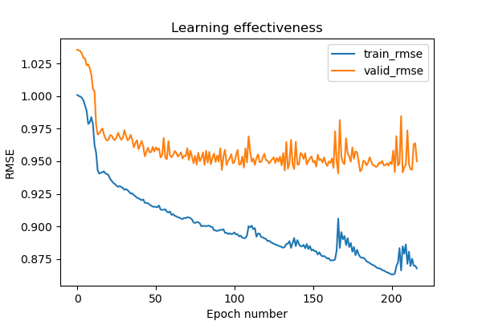
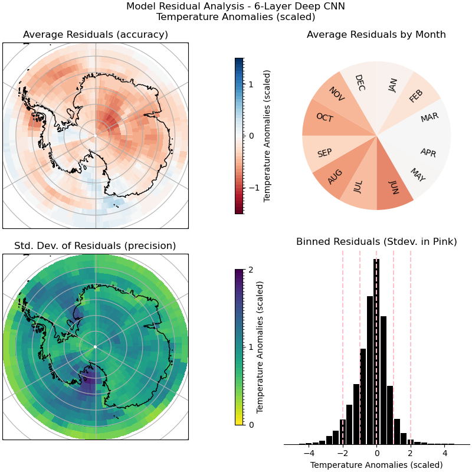

## Methods 

Sections:
> 1. Preprocessing
> 2. Baseline Models 
> 3. Gaussian Process (GP) Models 
> 4. Deep Learning (DL) models 
> 5. Postprocessing and Evaluation 

### 1. Preprocessing 


The full IsoGSM xArray dataset (42 years) is first split into 3 smaller datasets: 
> 1. `train_ds`: Has data from 1995 - 2020 inclusive (26 years). This data will be used to train our ML models. 
> 2. `valid_ds`: Has data from 1987 - 1994 inclusive (8 years). This data will be used to continuously evaluate the different ML models that we build.
> 3. `test_ds`: Has data from 1979 - 1986 inclusive (8 years). This data will be used at the very end of our project to get a performance score of the final ML models chosen. 

The `preprocessing.py` script will be called separately on each of these 3 datasets, performing the following steps: 

**1. Select only the data variables in the dataset that we are interested in** 

- `d18O_pr`, `hgtprs`, `pratesfc`, and `tmp2m`

**2. Change the latitude/longitude dimensions for `hgtprs` (geopotential height)**

- Specific to the IsoGSM dataset, the variable `hgtprs` (geopotential height) is encoded on a different latitude and longitude grid than the other variables (dims = `latitude_2`, `longitude_2`). 
- Thus, we use linear interpolation to remap these latitude and longitudes to the grid used by the other variables. 

**3. Deseasonalize our data (optional)**

- When deseasonalizing is selected, the monthly means across all years for each latitude and longitude coordinate is computed for each variable (from data in `train_ds`). Then, the monthly means are subtracted from the original values. 
- When deseasonalizing `valid_ds` and `test_ds`, the monthly means computed from the training data are subtracted from the original values. 

**4. Add new features including polar coordinates, months, and years** 

- Using the [`polarstereo-lonlat-convert-py`](https://github.com/nsidc/polarstereo-lonlat-convert-py) package, the latitudes and longitudes are converted to polar coordinates and added to the preprocessed dataset as new data variables (features). 
- Add a feature indicating the month as an integer (1 to 12).
- Add a feature indicating the year as an integer. 

**5. Interpolate missing values (i.e. NaN entries)**

- For any data variables with missing values (NaNs), the Xarray [advanced interpolation](https://docs.xarray.dev/en/stable/user-guide/interpolation.html#advanced-interpolation) method using the dimensions time, latitude, and longitude to fill in the missingness. 
- Interpolation is only done for `train_ds` - the NaN values are retained in `valid_ds` and `test_ds`.   

**6. Scale variables** 

- The means and standard deviations of each of the data variables are computed (from data in `train_ds`). Then, the original values are scaled (value - mean / standard deviation). 
- When scaling `valid_ds` and `test_ds`, the means and standard deviations from `train_ds` are used. 

### 2. Baseline Models 

The RMSE scores the following simple baseline models are used as a comparison for the final models' performances: 

| Baseline Model  | Description |
| ------------- | ------------- |
| `overall_mean`  | For a given output variable in the validation or test set, it predicts that each `y` value will be the overall mean of the variable in the training set.  |
| `latlon_mean`  | For a given output variable at a specific latitude and longitude position in the validation or test set, it predicts that each `y` value will be the overall mean of the variable in the training set at that specific latitude and longitude over all time points. |
| `latlonmonth_mean`  | For a given output variable at a specific latitude and longitude position and time (month) in the validation or test set, it predicts that each `y` value will be the overall mean of the variable in the training set at that specific latitude and longitude and month over all years. |
| `ols` | For a given output variable, it fits a simple ordinary least squares (ols) regression model relating `x` (`d18O_pr`) to `y` (i.e. `y ~ x`) using the training set. Then, it takes the slope and intercept from the fitted model to predict `y` values from `x` values in the test set. | 

### 3. Gaussian Process (GP) Models 

#### Mathematical Background of Gaussian Processes


Gaussian Process (GP) models were first introduced by Sacks et al. (1989).
A GP model extends the ordinary least squares (OLS) regression model in a way that offers more model flexibility by accommodating non-linear relationships and capturing the correlation structure of the data.

Assuming that we have a training data set with $n$ observations, let $y_i$ denote the $i\text{th}$ observed value of a specific climate variable (e.g. temperature
or precipitation), and let
```math
\mathbf{x}_i = \begin{pmatrix} {x}_{i,1}\ {x}_{i,2}\ {x}_{i,3}\ {x}_{i,4}\ {x}_{i,5} \end{pmatrix}^\intercal = \begin{pmatrix} \delta^{18}\text{O}_i\  \text{E}_{\text{UPS}, i}\  \text{N}_\text{UPS, i}\ \text{oro}_i \ d_{\text{coast}, i} \end{pmatrix}^\intercal \qquad (1)
```
denote the corresponding observed values of the ML model’s input variables (as prepared in the preprocessed dataset; see table 3.1).

Recall that an OLS regression model relates the input variables in $\mathbf{x}$ to an output variable $y$ via a linear equation:

```math
y_i = \beta_0 + \mathbf{\beta}^\intercal \mathbf{x}_i + \varepsilon_i \qquad (2)
```

In $(2)$, $\beta_0$ is a scalar, $\mathbf{\beta} = \begin{pmatrix} \beta_1\ \beta_2\ \beta_3\ \beta_4\ \beta_5\ \end{pmatrix}^\intercal$ is a vector of scalar coefficients, and $\varepsilon_i$ is a random variable. The parameter $\beta_0$ represents the linear model's intercept, and the parameters in $\mathbf{\beta}$ represent the linear model's slope with respect to each of the model's input variables. Further, the random variable $\varepsilon_i$ represents the model's error-term.  This term is assumed to be independently identically distributed as $\epsilon_i\sim\mathcal{N}(0,\sigma^2)$ for all $i = 1,\dots, n$, where $\sigma^2$ is the common variance of the error-terms.

The assumption of a linear relationship between input and output variables is quite restrictive in the sense that it does not allow for modelling complex non-linear relationships. Further, the independence assumption of OLS does not hold for climate data due to the spatial-temporal nature of such data. As such, we believe that better model performance† can be achieved by utilizing models that can accommodate both non-linearity and non-independence (†performance as measured by various metrics; see the postprocessing section for more details).

One such model is a GP model, which relates the input variables in $\mathbf{x}$ to an output variable $y$ via an equation quite similar to $(2)$ from OLS:

```math
y_i = \beta_0 + \mathbf{\beta}^\intercal \mathbf{x}_i + Z(\mathbf{x}_i) \qquad (3)
```

In $(3)$, $\beta_0$ and $\mathbf{\beta}$ are the same as they were in $(2)$ (i.e. intercept and slopes). The random variable $\epsilon_i$ from $(2)$ has been replaced by a different random variable $Z(\mathbf{x}_i)$, and, as before, this stochastic term represents the model's error-term. However, this error-term $Z(\mathbf{x}_i)$ is **not** assumed to be independent for all $i = 1,\dots, n$. Instead, a GP model assumes that the error-terms follow an identical _marginal_ distribution $Z(\mathbf{x}_i)\overset{\text{marginal}}{\sim}\mathcal{N}(0, \sigma^2)$ for all $i = 1,\dots, n$, where $\sigma^2$ is the common variance of the error-terms (also known as the 'overall process variance').

The key distinction between OLS models and GP models lies in their correlation structure. While the OLS model assumes no correlation between error terms ($\text{Cor}(\varepsilon_i, \varepsilon_j) = 0 \text{ for }i \neq j$), a GP model assumes that observations have a correlation structure which is determined by a correlation function $R(·\ ,\ ·)$:
```math
\text{Cor}(Z(\mathbf{x}_i), Z(\mathbf{x}_j)) = R(\mathbf{x}_i, \mathbf{x}_j)\in[0,1] \qquad (4)
```
The correlation function $(4)$ is often decomposed into a product of kernel functions $\mathcal{K}(.\ ,\ .)$. Recall that we have $5$ input features, as specified in $(1)$. Thus, we have:
```math
\begin{aligned}
  R(\mathbf{x}_i, \mathbf{x}_j) &= \prod_{k=1}^5 \mathcal{K}_k({x}_{i,k},\ {x}_{j,k}) \quad &(5)\\
    &=  \mathcal{K}_1(\delta^{18}\text{O}_i,\ \delta^{18}\text{O}_j)  & \\ & \quad \times \mathcal{K}_2( \text{E}_{\text{UPS}, i}\, \text{E}_{\text{UPS}, j}) \times  \mathcal{K}_3(\text{N}_\text{UPS, i}\, \text{N}_\text{UPS, j})  & \\ & \quad\times \mathcal{K}_4(\text{oro}_i, \text{oro}_j) \times \mathcal{K}_5(\ d_{\text{coast}, i}, \ d_{\text{coast}, j}) \quad &(6)
\end{aligned}
```

A kernel function $\mathcal{K}$  models the correlation between observations as a function of their distance in the input feature space. In supervised machine learning the notion of similarity between data points is crucial; it is a basic assumption that points with input features $x$ which are close are likely to have similar target values $y$, and thus training points that are near to a test point should be informative about the prediction at that point. In a GP model it is the kernel functions $\mathcal{K}$ that defines closeness or similarity [insert citation].

In addition to allowing GP models to capture correlation between variables, the use of kernel functions also allows GP models to model non-linear relationships. The GP model equation $(3)$ includes a linear regression component, but kernel functions can be (and usually are) non-linear.  
There are many kernel functions available in the literature (Duvenaud 2014).
For example, there are kernel functions which are able to directly model seasonal temporal correlation structures (Roberts et al. 2013). The kernel function is the crucial ingredient in a GP model since it encodes our assumptions about the correlation structures of the data [insert citation].
Thus, we dedicated a large amount of effort to selecting the most appropriate kernel functions.

For our project, we primarily used Radial Basis Functions (RBFs) as our kernel function:
```math
\mathcal{K}_{\text{RBF}}({x}_i,\ x_j) = \exp \left( -\frac{1}{2}\frac{   |{x_i} - {x_j}| }{\theta^2}
\right) \qquad (7)
```
This function assigns values near to $1$ for variables with similar corresponding inputs and decreases the covariance exponentially as the distance between inputs increases. It includes a learned parameter $\theta$ which controls the rate of exponential decay for the covariance with respect to the input feature's distance. In the context of this project, we can combine equations $(4)$ through $(7)$ to see that our GP model's correlation function was given by:
```math
\begin{aligned}
\text{Cor}(Z(\mathbf{x}_i), Z(\mathbf{x}_j)) &= \prod_{k=1}^5 \mathcal{K}_{\text{RBF}}({x}_{i,k},\ {x}_{j,k}) \quad &(8) \\
&= \exp\left( -\frac{1}{2}\frac{   |\delta^{18}\text{O}_i,\ \delta^{18}\text{O}_j)| }{\theta_1^2}\right)  & \\ & \qquad \times\exp\left( -\frac{1}{2}\frac{   |\text{E}_{\text{UPS}, i}\, \text{E}_{\text{UPS}, j}| }{\theta_2^2}\right) \times \exp\left( -\frac{1}{2}\frac{   |\text{N}_{\text{UPS}, i}\, \text{N}_{\text{UPS}, j}| }{\theta_3^2}\right)  &  \\ & \qquad \times \exp\left( -\frac{1}{2}\frac{   |\text{oro}_i, \text{oro}_j| }{\theta_4^2}\right)  \times \exp\left( -\frac{1}{2}\frac{   |d_{\text{coast}, i}, \ d_{\text{coast}, j}| }{\theta_5^2}\right)  \quad &(9)\\
\end{aligned}
```

Importantly, notice that in $(9)$ there is a distinct parameter $\theta_k$ for each of the $5$ input features.

The GP models offer a powerful framework for capturing non-linear relationships and accounting for the correlation structure present in the data. By leveraging the flexibility of the kernel function, GP models have the potential to provide improved predictions of temperature, geopotential height, and precipitation compared to linear regression models like OLS.

**Table 3.1: GP Model Input (X) and Output (Y) Variables**

| Input Variables                                      | Output Variables                              |
|------------------------------------------------------|-----------------------------------------------|
| Scaled & Deseasonalized† delta 18-O of precipitation  | Scaled & Deseasonalized† Temperature            |
| Scaled Easting Coordinate                            | Scaled & Deseasonalized† Geopotential Height    |
| Scaled Northing Coordinate                           | Scaled & Deseasonalized† Precipitation Rate     |
| Scaled Distance to Coast                             |                                               |
| Scaled Surface Orography                             |                                               |
| Month (integer)††                                    |                                               |

   > Table 3.1 summarizes the GP model's input and output variables. These variables have been preprocessed following the procedure outlined in the [Preprocessing](#preprocessing) section. 
   >
   > † The temporal variables are only deseasonalized for certain kernels (those with an odd ID). 
   >
   > †† The "month" variable is only included for certain kernels (those with an even ID). This variable is an integer where Jan=1 and Dec=12. 

#### GPyTorch Kernels

In addition to RBF kernels, we explored some alternative GP kernel functions. We prepared a total of 7 different pre-made kernel configurations that can be easily loaded using the `get_kernel()` function from `GaussianProcesses.kernels`. An overview of these kernel configurations is provided in table 3.2. See the [kernel guide](/guides/GaussianProcesses/kernels.md) for more information.


**Table 3.2: Kernel Configurations**

| Kernel ID | `GPyTorch` Kernels used           | Uses month as an input variable? |
|-----------|----------------------------------|----------------------------------|
| 0         | `RBFKernel` + `PeriodicKernel`        | Yes (non-deseasonalized data)    |
| 1         | `RBFKernel`                        | No (deseasonalized data)         |
| 2         | `PiecewisePolynomialKernel` + `PeriodicKernel`  | Yes (non-deseasonalized data)    |
| 3         | `PiecewisePolynomialKernel`        | No (deseasonalized data)         |
| 4         | `RQKernel` + `PeriodicKernel`          | Yes (non-deseasonalized data)    |
| 5         | `RQKernel`                        | No (deseasonalized data)         |
| 6         | NA                               | NA                               |
| 7         | `SpectralMixtureKernel`             | No (deseasonalized data)         |

> Table 3.2 provides information on the kernel configurations used in the GP models. It lists the kernel IDs, the corresponding `GPyTorch` kernels used, and whether the month is used as an input variable. It also presents the equation that represents the kernel for each configuration. Please note that kernel 6 (NA) does not exists because the `SpectralMixtureKernel` cannot be combined with the `PeriodicKernel`.

- Note that we use a [`PeriodicKernel`](https://docs.gpytorch.ai/en/stable/kernels.html#periodickernel) for the `month` feature if it is included.:
   - The `month` feature is included if the training data is *not* deseasonalized, but `month` is *not* included if the training data **is** deseasonalized.
   - Kernels with an even ID use the `month` feature and don't deseasonalize. Kernels with an odd ID deseasonalize and don't use the `month` feature.

Relevant `GPyTorch` documentation:

- [RBFKernel](https://docs.gpytorch.ai/en/stable/kernels.html#rbfkernel)
- [PiecewisePolynomialKernel](https://docs.gpytorch.ai/en/stable/kernels.html#piecewisepolynomialkernel)
- [RQKernel](https://docs.gpytorch.ai/en/stable/kernels.html#rqkernel)
- [SpectralMixtureKernel](https://docs.gpytorch.ai/en/stable/kernels.html#spectralmixturekernel)
- [PeriodicKernel](https://docs.gpytorch.ai/en/stable/kernels.html#periodickernel)


#### Training GP Models (Sockeye)

Training GP models involves the computation of pairwise distances between all training data points in a matrix, which requires large memory and time resources. To overcome this challenge, we obtained computational resources from [UBC ARC Sockeye](https://arc.ubc.ca/ubc-arc-sockeye), which allowed us to use computational nodes of up to 186 GB. We also reduced our training dataset of 26 years and ~780,000 examples into smaller splits of a few consecutive years each. See table 3.3 for more information. 

To implement GP models for our project, we will consider different kernel configurations and split our data into training and validation sets. The training set will be used to fit the GP model, while the validation set will be used to tune hyperparameters and select the best kernel configuration.

**Table 3.3: GP Model Details and Validation RMSEs on Scaled Anomalies**

| Kernel | Learning Rate | Num. Epochs | Num. Splits | Num. Examples | Temp. RMSE | Geopt. RMSE | Precip. RMSE | Memory (GB) | Runtime (h) |
|--------|---------------|-------------|-------------|---------------|------------|------------|--------------|-------------|-------------|
| 1      | 0.15          | 10          | 13          | ~60,000       | 1.14       | 1.18       | 1.08         | 72          | 3-4         |
| 2      | 0.15          | 10          | 13          | ~60,000       | 1.11       | 1.15       | 1.14         | 155         | 2-3         |
| 3      | 0.15          | 10          | 13          | ~60,000       | 1.13       | 1.16       | 1.14         | 132         | 1-2         |
| **1**  | **0.0015**    | **10**      | **9**       | **~87,000**   | **0.99**   | **1.03**   | **1.00**     | **150**     | **2-3**     |
| 1      | 0.00075       | 10          | 9           | ~87,000       | 0.98       | 1.03       | 1.00         | 150         | 4-5         |

   > Table 3.3 displays a summary of notable configurations run, varying the type of kernel, learning rate, number of splits, and validation RMSE scores on the three climate variables. It also displays the memory and runtime utilized on Sockeye when training the models. The three kernels used were "RBFKernel" (kernel 1), "PiecewisePolynomialKernel" (kernel 2), and "RQKernel" (kernel 3). All three displayed similar performances when trained on ~60,000 examples. However, we noticed that kernel 1 required less memory resources (72 GB compared to >100 GB), which would allow us to include more examples during training. Decreasing the learning rate (from 0.0015 to 0.00075) also did not appear to significantly improve RMSE scores but did increase runtime. Thus, we decided to move forward with a GP model with kernel 1, a learning rate of 0.0015, and 9 splits.

### 4. Deep Learning (DL) Models 

The Neural Network model is a deep convolutional neural network with 6 hidden layers. Each CNN layer passes a 2-dimensional kernel across the 15 by 192 latitude x longitude grid of Antarctica. After each layer the outputs are passed through a ReLU activation function. The specific architecture by layer is specified in the table below:

| Layer  | Input Channels | Output Channels | Kernel Size |
| --- | --- | --- | ---- |
| 1     | 6<sup>1</sup>     | 32     | 5 x 17 |
| 2     | 32     | 32     | 5 x 15 |
| 3     | 32     | 16     | 5 x 13 |
| 4     | 16     | 16     | 3 x 13 |
| 5     | 16     | 8     | 3 x 11 |
| 6     | 8     | 3<sup>2</sup>     | 3 x 9 |

#### <sup>1</sup>Input Variables (6) per Lat/Lon point:
1. Scaled & Deseasonalized delta 18-O of precipitation 
2. Scaled Easting Coordinate
3. Scaled Northing Coordinate
4. Scaled Distance to Coast (negative distances == points at sea)
5. Scaled Surface Orography
6. Land / Sea Boolean Mask

#### <sup>2</sup>Output Variables (3) per Lat/Lon point:
1. Scaled & Deseasonalized Temperature
2. Scaled & Deseasonalized Geopotential Height
3. Scaled & Deseasonalized Precipitation Rate

The model was trained until there was no improvement in validation RMSE for 50 consecutive epochs, which occurred after 215 epochs.




#### Neural Network Performance


|  | Temperature | Precipitation Rate | Geopotential Height |
| ------------ | -------- | -------- | -------- |
| Test RMSE on Anomalies | 0.96 | 1.07 | 0.96 |
| Test RMSE in Original Units | 2.07 °K | 0.515 mm/day | 54.6 m |


### 5. Postprocessing and Evaluation 

The postprocessing analysis uses a set of 4 plots to check for patterns in the residuals, including across space (lat, lon) and over time (months). Below is an example of these plots using the temperature anomaly residuals from the neural network model on the test dataset:



The two maps on the left visualize the residuals over space. The top left plot shows the average of the residuals at each lat, lon point. If the model consistently over (under) predicts temperature in a certain region, that region will be dark red (blue). Below this is a map of the standard deviation of residuals on the same lat, lon point grid. The gradient from yellow (best) to blue (worst) indicates where the model is precise, regardless of how accurate it is. For example, a region that always overpredicts 1 standard deviation too high would be dark red on the accuracy map but yellow on the precision map, and represents a biased but consistent model.

The top-right plot groups the residuals by month and calculates the average of the residuals in each month using the same scale as the top-left map. This plot detects seasonal patterns in the residuals. In the above example, the darker reds in all months between June and November suggest that the model is systematically biased during this time of year and has failed to fully capture the seasonal cycle in the data.

The final plot on the bottom-right is a simple histogram of all the residuals. Heavier tails here suggest weaker models, and any skewness represents biases the model has learned. 
